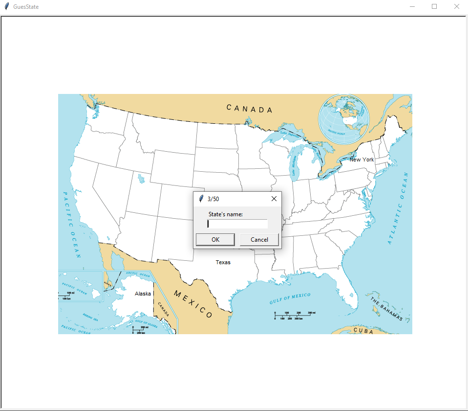

# Gueßtate
Simple Python game where you can practice your knowledge on U.S. States.

## Screen-shot


## How to Run?
- Download Zip-file or using git
```
git clone https://github.com/karolkasperek/GuesState.git
```
- Using Python download pandas library
```
pip install pandas
```
- Open folder with main.py module and run it
```
python main.py
```
